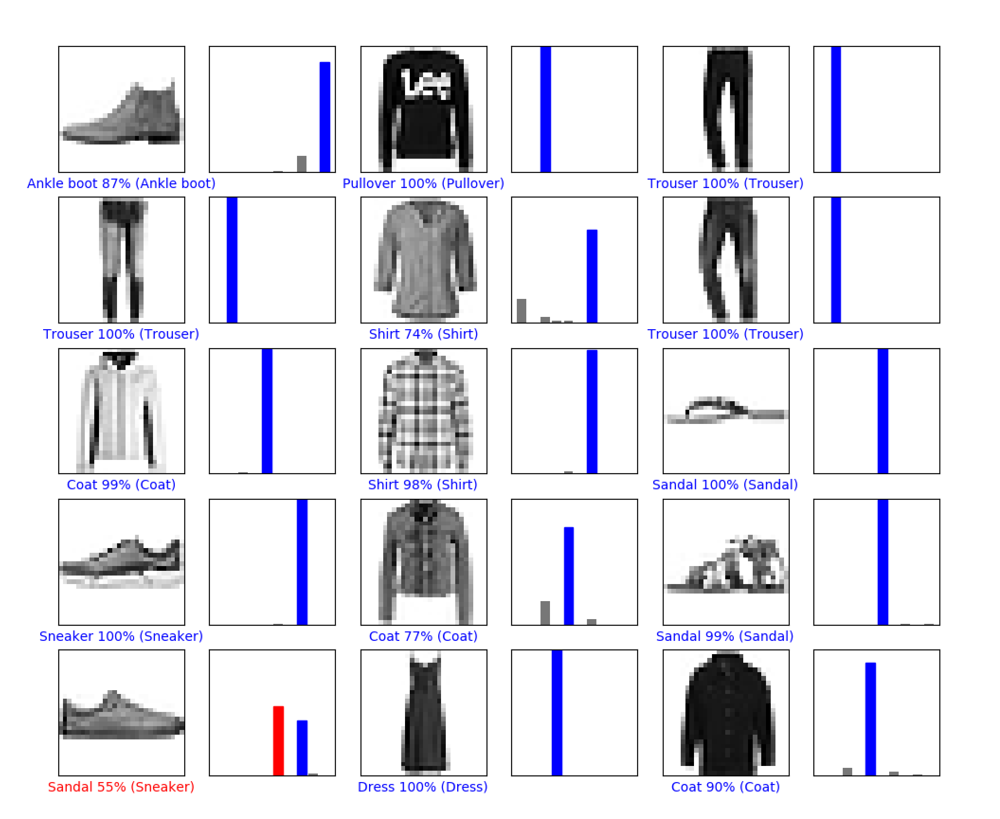

# Fashon Mnist Tensorflow

## Background

This program follows the tutorial from the [Tensorflow](https://www.tensorflow.org/tutorials/keras/basic_classification) site.

The purpose of this tutorial is how to use high level functions in Tensorflow to identify different items of clothing from the Fashon Mnist dataset.

## Dataset

The dataset is a free dataset found in the keras library in Tensorflow. The dataset is made up of 70,000 28 x 28 images of 10 different clothing styles including: 

T-shirt/top, Trouser, Pullover, Dress, Coat, Sandal, Shirt, Sneaker, Bag, Ankle boot.

The program uses 60,000 of these images for training and 10,000 for testing.

### Output

The program trains the network then tests the network with 10,000 images.

An average accuracy of 86% on the training data is achieved.

The program also uses pyplot to show the predictions of the first 25 of the images.

